# 🚀 Cross-Validation 
---
Gordon.H | SHSID Data Science Club
---

Hello again! We have just learned how to spot underfitting (high bias) and overfitting (high variance). We've even learned how to *tame* overfitting with regularization.

But this raises a crucial question: **How do we get a reliable score for our model?** How can we be sure that a model is genuinely good, and not just "lucky" on the one-time test set we gave it?

Today, we'll learn the gold-standard technique for model evaluation: **Cross-Validation**.

### Our Learning Journey Today

We'll learn the professional's method for evaluating models and tuning their "dials" (hyperparameters).

```mermaid
graph LR
    A[📍 We are here<br>We know about train/test split] --> B(Part 1: The Problem with a Single Split<br><i>The "Lucky" Test Set</i>);
    B --> C(Part 2: K-Fold Cross-Validation<br><i>The Fair Solution</i>);
    C --> D(Part 3: The Killer App: Hyperparameter Tuning<br><i>Finding the Best Settings</i>);
    D --> E(🏆 We will be here<br>You can confidently evaluate and tune any model);

    style A fill:#f9f,stroke:#333,stroke-width:2px
    style E fill:#9f9,stroke:#333,stroke-width:2px
```

---

## Part 1: The Problem with a Single Train/Test Split

So far, you've probably seen this workflow:
1.  Take all your data.
2.  Split it once into a training set and a testing set (e.g., 80% train, 20% test).
3.  Train your model on the training set.
4.  Evaluate its performance on the testing set.

```mermaid
graph LR
    subgraph Single Split Method
        Data[Full Dataset] --> Split{80/20 Split}
        Split --> Train[Training Set (80%)]
        Split --> Test[Test Set (20%)]
        Train --> Model[Train Model]
        Model --> Evaluate
        Test --> Evaluate{Evaluate Model}
        Evaluate --> Score[Get ONE Score]
    end
```

**The Problem:** The final score depends heavily on *which* 20% of the data ended up in the test set.
*   What if, just by random chance, the test set contained all the "easy" examples? You'd get a great score and think your model is a genius!
*   What if the test set happened to get all the "hard" or "weird" examples? You'd get a terrible score and might discard a perfectly good model.

This is **high variance in your evaluation**. The score you get is not stable or reliable. We need a better, more robust way.

---

## Part 2: K-Fold Cross-Validation - A More Robust Referee

Instead of a single split, Cross-Validation says: **"Let's do this multiple times and average the results!"**

The most common method is **K-Fold Cross-Validation**.

**The Main Idea:**
1.  Split the *entire* dataset into `K` equal-sized "folds" (or groups). A common choice for `K` is 5 or 10.
2.  Then, we run `K` experiments. In each experiment:
    *   We pick **one** fold to be our test set.
    *   We use the **remaining `K-1` folds** as our training set.
3.  We train the model, evaluate it on the test fold, and record the score.
4.  After running `K` times (with each fold getting a turn to be the test set), we average the `K` scores to get a final, more reliable performance estimate.

### Visualizing 5-Fold Cross-Validation (K=5)

```mermaid
graph LR
    Data[Full Dataset] --> S[Split into 5 Folds]
    S --> F1[Fold 1] & F2[Fold 2] & F3[Fold 3] & F4[Fold 4] & F5[Fold 5]
    
    subgraph Iteration 1
        direction LR
        Train1[Train on F2,F3,F4,F5] --> Test1(Test on F1) --> Score1[Score 1]
    end
    
    subgraph Iteration 2
        direction LR
        Train2[Train on F1,F3,F4,F5] --> Test2(Test on F2) --> Score2[Score 2]
    end

    subgraph Iteration 3
        direction LR
        Train3[Train on F1,F2,F4,F5] --> Test3(Test on F3) --> Score3[Score 3]
    end

    subgraph Iteration 4
        direction LR
        Train4[Train on F1,F2,F3,F5] --> Test4(Test on F4) --> Score4[Score 4]
    end

    subgraph Iteration 5
        direction LR
        Train5[Train on F1,F2,F3,F4] --> Test5(Test on F5) --> Score5[Score 5]
    end
    
    Score1 & Score2 & Score3 & Score4 & Score5 --> Final{Average the Scores}
    Final --> FinalScore[<b>Final CV Score</b><br>± a measure of variance]

    style Test1 fill:#f99
    style Test2 fill:#f99
    style Test3 fill:#f99
    style Test4 fill:#f99
    style Test5 fill:#f99
```



### The Math: Simple and Sweet

The final Cross-Validation score is just the average of the scores from each fold.

$$ \text{CV}_{\text{score}} = \frac{1}{K} \sum_{i=1}^{K} \text{score}_i = \frac{\text{score}_1 + \text{score}_2 + ... + \text{score}_K}{K} $$

We also look at the **standard deviation** of the scores. A low standard deviation tells us the model's performance is stable and consistent across different subsets of the data. A high standard deviation means the performance is erratic.

### 🐍 Python Example: Evaluating Our Bias-Variance Models

Let's use 5-fold CV to evaluate the three polynomial models from our last lesson. Which one will CV tell us is the best?

```python
import numpy as np
from sklearn.model_selection import cross_val_score
from sklearn.pipeline import make_pipeline
from sklearn.linear_model import LinearRegression
from sklearn.preprocessing import PolynomialFeatures

# 1. Generate the same sample data
np.random.seed(0)
X = np.linspace(0, 10, 100).reshape(-1, 1) # More data points for CV
y = np.sin(X).ravel() + np.random.normal(0, 0.5, 100)

# 2. Define our three models from the bias-variance lesson
underfit_model = make_pipeline(PolynomialFeatures(degree=1), LinearRegression())
just_right_model = make_pipeline(PolynomialFeatures(degree=4), LinearRegression())
overfit_model = make_pipeline(PolynomialFeatures(degree=15), LinearRegression())

# 3. Use 5-fold cross-validation (cv=5) to evaluate each model
# 'neg_mean_squared_error' is used because scikit-learn likes to maximize scores.
# We'll just flip the sign back to positive to interpret it as error.
scores_underfit = -cross_val_score(underfit_model, X, y, cv=5, scoring='neg_mean_squared_error')
scores_just_right = -cross_val_score(just_right_model, X, y, cv=5, scoring='neg_mean_squared_error')
scores_overfit = -cross_val_score(overfit_model, X, y, cv=5, scoring='neg_mean_squared_error')

# 4. Print the results
print("--- Underfit Model (Degree 1) ---")
print("Individual Fold Errors:", scores_underfit.round(2))
print(f"Average CV Error: {scores_underfit.mean():.2f} (+/- {scores_underfit.std():.2f})\n")

print("--- Just Right Model (Degree 4) ---")
print("Individual Fold Errors:", scores_just_right.round(2))
print(f"Average CV Error: {scores_just_right.mean():.2f} (+/- {scores_just_right.std():.2f})\n")

print("--- Overfit Model (Degree 15) ---")
print("Individual Fold Errors:", scores_overfit.round(2))
print(f"Average CV Error: {scores_overfit.mean():.2f} (+/- {scores_overfit.std():.2f})\n")
```

**Expected Output & Analysis:**
*   **Underfit Model:** Will have a consistently high error (e.g., avg error ~0.6). The standard deviation will be relatively low because it's consistently bad.
*   **Just Right Model:** Will have the **lowest average error** (e.g., avg error ~0.25). This is our winner!
*   **Overfit Model:** Will have a very high average error, and likely a **huge standard deviation**. This is because its performance is highly dependent on the specific data in each fold—it does well on some folds and terribly on others.

Cross-validation correctly and reliably identified the "Just Right" model as the best!

---

## Part 3: The Killer Application: Hyperparameter Tuning

Models have "dials" you can turn called **hyperparameters**. Examples include:
*   The `alpha` ($\lambda$) in Ridge and Lasso regression.
*   The `C` and `gamma` ($\gamma$) in Support Vector Machines.
*   The `degree` of the polynomial we just used.

How do we find the *best* setting for these dials?

**The Golden Rule of Machine Learning:** The test set is a final exam. You only use it **ONCE**, at the very end, to report your final score. You cannot use it to tune your hyperparameters. Using the test set to pick the best `alpha` is a form of "cheating" or **data leakage**.

So, how do we do it? **We use Cross-Validation on the training set!**

### The Correct Workflow

```mermaid
graph LR
    Data[Full Dataset] --> Split1{<b>Step 1: The Great Split</b><br>Split into Train & Final Test sets}
    Split1 --> FinalTest[<b>Final Test Set (20%)</b><br>LOCK THIS AWAY! 🔒]
    Split1 --> TrainVal[Training + Validation Set (80%)]
    
    subgraph Step 2: Hyperparameter Tuning using CV
        direction LR
        TrainVal --> CV[Perform K-Fold CV<br>within this 80% data]
        CV -- "for each alpha value" --> Scores[Get avg CV score for alpha]
    end
    
    Scores --> Best[Find alpha with best CV score]
    
    Best --> Step3["<b>Step 3: Final Training</b><br>Train a NEW model on ALL of the<br>Training+Validation data (80%),<br>using the best alpha."]
    
    Step3 --> FinalEval["<b>Step 4: Final Evaluation</b><br>Unlock the Test Set! 🔓<br>Evaluate your final model ONCE."]
    FinalTest --> FinalEval
    FinalEval --> Report[Report Final Score]

    style FinalTest fill:#f99
```

This seems complicated, but thankfully, `scikit-learn` has a tool that does all of Step 2 for us automatically: `GridSearchCV`.

### 🐍 Python Example: Finding the Best `alpha` for Ridge Regression

`GridSearchCV` will test a "grid" of hyperparameter values using cross-validation and tell us which one was the best.

```python
from sklearn.model_selection import GridSearchCV
from sklearn.linear_model import Ridge

# 1. We're still using our same X and y data.
#    Imagine this is our "Training + Validation Set (80%)"

# 2. Define the model we want to tune
model_to_tune = Ridge()

# 3. Set up the "grid" of hyperparameters to test.
#    We'll give it a list of different alpha values to try.
param_grid = {
    'alpha': [0.001, 0.01, 0.1, 1, 10, 100, 1000] # These are the λ values
}

# 4. Set up GridSearchCV
#    It will try each alpha value using 5-fold CV.
#    n_jobs=-1 uses all your computer's cores to speed it up!
grid_search = GridSearchCV(model_to_tune, param_grid, cv=5, scoring='neg_mean_squared_error')

# 5. Run the search! This does all the work from the diagram's "Step 2".
grid_search.fit(X, y)

# 6. Print the best results
print("GridSearchCV found the best settings!")
print("Best alpha (λ):", grid_search.best_params_)
print("Best CV Score (MSE):", -grid_search.best_score_)
```
**Analysis:**
`GridSearchCV` will automatically iterate through all the `alpha` values, perform 5-fold cross-validation for each one, and store the results. The `.best_params_` attribute will show you which `alpha` gave the lowest average error across the folds. You would then take this `alpha` to train your final model.

---

## A Quick Note on Other CV Methods

*   **Stratified K-Fold:** When you have a classification problem with imbalanced classes (e.g., 99% not-fraud, 1% fraud), you need to make sure each fold has the same percentage of each class. `StratifiedKFold` does this automatically.
*   **Leave-One-Out (LOOCV):** This is K-Fold where `K` is equal to the number of data points. In each step, you train on all data points except one, and test on that one. It's very thorough but extremely slow and usually only used for very small datasets.

## Conclusion: Your Professional ML Workflow

You now have the complete, professional workflow for building a machine learning model.

> **Your Problem-Solving Guide:**
>
> 1.  **Split Data:** Perform the one-time split into `train_set` and `test_set`. Lock the `test_set` away.
> 2.  **Choose a Model:** Pick a model appropriate for your problem (e.g., Ridge for regression, SVM for classification).
> 3.  **Tune Hyperparameters:** Use **GridSearchCV** on the `train_set` to find the best hyperparameters for your model.
> 4.  **Train Final Model:** Train your chosen model with the best hyperparameters on the *entire* `train_set`.
> 5.  **Final Evaluation:** Unleash the `test_set` and evaluate your final model once to get its true performance score.

Cross-validation is the bridge between theory and practice. It's how we move from worrying about bias and variance to confidently building models that work well in the real world. Happy (and robust) modeling