# Lesson 3.4 ｜ Regularization, Bias-Variance Trade-off, Kernel Methods 🚀
---
* Gordon.H | SHSID ML Club
---
Hi, Junior ML engineer, welcome back to the course. Today,we will explore some of the most powerful concepts in machine learning.
So far, you have learned about building basic models like linear regression. 
But have you ever wondered...

* "Why is my model so bad at predicting things it has not seen before?"
* "How do I stop my model from just memorizing the answers?"
* "How can a computer find patterns that aren't just straight lines?"

Today we will learn about three foundational concepts that are at the heart of modern machine learning.

Here is an overview of this lesson:

```mermaid
graph LR
    A[📍 You are here<br>You can build a basic model] --> B(Part 1: The Bias-Variance Tradeoff<br><i>The #1 challenge in ML</i>);
    B --> C(Part 2: Regularization<br><i>The cure for 'memorizing'</i>);
    C --> D(Part 3: The Kernel Method<br><i>The magic trick for complex patterns</i>);
    D --> E(🏆 You will be here<br>You can build robust, flexible models);

    style A fill:#f9f,stroke:#333,stroke-width:2px
    style E fill:#9f9,stroke:#333,stroke-width:2px
```



---

## Part 1: Bias Variance Trade-Off 🐻

Every machine learning model you build faces a fundamental tug-of-war. It's a balance between being too simple and being too complex. Getting this balance right is the key to a good model. This is the **Bias-Variance Tradeoff**.

## The Bullseye Analogy 🎯

Imagine an archer trying to hit the bullseye, the true underlying pattern of the data.


*   **Bias (Underfitting):** High bias is like a misaligned scope on a rifle. You are consistently wrong in the same way. Your model is too simple and has a fundamental "bias" that prevents it from capturing the truth.
*   **Variance (Overfitting):** High variance is like an archer with a shaky hand. Your shots are inconsistent. Your model is too complex and is distracted by random noise in the data, causing its predictions to vary wildly with new data.

### The Error Curve: The Fix
This is one of the most important graphs in machine learning. It shows how error changes as we make a model more complex. Our goal is to find the lowest point of the "Total Error" curve.


### Python Example - Visualizing the Tradeoff: 
We'll try to fit models of different complexities to some curvy data.

```python
import numpy as np
import matplotlib.pyplot as plt
from sklearn.pipeline import make_pipeline
from sklearn.linear_model import LinearRegression
from sklearn.preprocessing import PolynomialFeatures

# 1. Generate some sample data (a sine wave with noise)
np.random.seed(0)
X = np.linspace(0, 10, 30).reshape(-1, 1)
y = np.sin(X).ravel() + np.random.normal(0, 0.5, 30)

# 2. Define models with different complexities (polynomial degree)
underfit_model = make_pipeline(PolynomialFeatures(degree=1), LinearRegression())
just_right_model = make_pipeline(PolynomialFeatures(degree=4), LinearRegression())
overfit_model = make_pipeline(PolynomialFeatures(degree=15), LinearRegression())

# 3. Fit the models
underfit_model.fit(X, y)
just_right_model.fit(X, y)
overfit_model.fit(X, y)

# 4. Plot everything
X_plot = np.linspace(0, 10, 100).reshape(-1, 1)
plt.figure(figsize=(15, 8))
plt.scatter(X, y, label='Original Data Points', color='black', zorder=5)

# Plot Underfit Model
plt.plot(X_plot, underfit_model.predict(X_plot), label='Underfit (Degree 1) - High Bias', color='red', linewidth=2)
# Plot Just Right Model
plt.plot(X_plot, just_right_model.predict(X_plot), label='Just Right (Degree 4) - Sweet Spot!', color='green', linewidth=4)
# Plot Overfit Model
plt.plot(X_plot, overfit_model.predict(X_plot), label='Overfit (Degree 15) - High Variance', color='orange', linewidth=2, linestyle='--')

plt.title('Visualizing the Bias-Variance Tradeoff', fontsize=16)
plt.xlabel('Feature', fontsize=12)
plt.ylabel('Target', fontsize=12)
plt.legend(fontsize=12)
plt.ylim(-3, 4)
plt.grid(True, linestyle='--', alpha=0.6)
plt.show()
```
**Analysis of the Plot:**
*   **🔴 Red Line (High Bias):** Too simple. It misses the curve entirely.
*   **🟠 Orange Line (High Variance):** Too complex. It wiggles frantically to "memorize" the noisy data.
*   **🟢 Green Line (Sweet Spot):** Just right. It captures the true trend while ignoring the noise.

---

## Part 2: Regularization - The Overfitting Tamer

We saw the huge problem of overfitting. We can use **Regularization** as our primary technique against it.

**The Main Idea**
We penalize a model for being too complex. We change its goal from *only* minimizing prediction error to minimizing error *AND* keeping its internal parameters (coefficients) small.

### The "Leash" Analogy
Regularization is like a leash, it pulls the model's coefficient back towards zero to prevent them being to large.


The regularization strength (`λ`, lambda) is the length of the leash. A bigger `λ` means a shorter an stronger leash, a simpler model, and less overfitting.

### The Two Flavors of Regularization: Lasso vs. Ridge

1.  **L2 Regularization (Ridge):** Uses a squared penalty: $\lambda \sum (\text{coefficient})^2$.
    *   **Effect:** Shrinks all coefficients, making the model more stable.

2.  **L1 Regularization (Lasso):** Uses an absolute value penalty: $\lambda \sum |\text{coefficient}|$.
    *   **Effect:** Shrinks some coefficients *all the way to zero*. This is powerful because it performs **automatic feature selection**, telling you which features are most important.

### Python: Visulizing How Regularization Works

Let's see the "shrinking" effect. We'll create a dataset with 2 important features and 8 useless "noise" features.

```python
import pandas as pd
from sklearn.linear_model import LinearRegression, Ridge, Lasso

# 1. Create a dataset with 2 important features and 8 useless "noise" features
np.random.seed(42)
n_samples = 50
n_features = 10
X = np.random.randn(n_samples, n_features)
# Create a target y where only the first two features matter
y = 2 * X[:, 0] + 3 * X[:, 1] + np.random.normal(0, 1, n_samples)

# 2. Train three models
lr = LinearRegression()
lr.fit(X, y)
ridge = Ridge(alpha=10) # alpha is lambda (λ) in scikit-learn
ridge.fit(X, y)
lasso = Lasso(alpha=0.1)
lasso.fit(X, y)

# 3. Create a bar chart of the coefficients
models = {'Linear Regression': lr, 'Ridge (L2)': ridge, 'Lasso (L1)': lasso}
df_coeffs = pd.DataFrame({name: model.coef_ for name, model in models.items()})

df_coeffs.plot(kind='bar', figsize=(15, 7))
plt.title('Comparing Coefficients of Different Models', fontsize=16)
plt.ylabel('Coefficient Value', fontsize=12)
plt.xlabel('Feature Index', fontsize=12)
plt.axhline(0, color='black', linewidth=0.5)
plt.xticks(rotation=0)
plt.grid(axis='y', linestyle='--', alpha=0.7)
plt.show()
```
**Analysis of the Chart:**
*   **🔵 Linear Regression:** Coefficients are large and noisy. It's trying to use useless features.
*   **🟠 Ridge (L2):** All coefficients are shrunk towards zero, making the model more stable.
*   **🟢 Lasso (L1):** The magic! It has set the coefficients for most of the useless features to **exactly zero**, correctly identifying the two important features.

---
## Part 3: The Kernel Method: Dimension Trick

What if your data looks like this? A simple line can't separate the classes. This is a **non-linear problem**.


**The Big Idea:** Let's project the data into a higher dimension where it *is* linearly separable.

### Visualizing the Transformation

The Kernel Method allows us to find a separating boundary in a high-dimensional space without ever actually calculating the new dimensions. It's a "trick" to handle non-linearity.


### The Kernel "Trick"

A **kernel** is a function that efficiently calculates the similarity between two points *as if* they were in that higher-dimensional space. The most powerful model using this is the **Support Vector Machine (SVM)**. The most popular kernel is the **RBF (Radial Basis Function) Kernel**, which is excellent for complex patterns.

### Python Ex: Solving Non-Linear with SVM

Let's use `scikit-learn` to create "moon" data and watch a Kernel SVM solve it effortlessly.

```python
from sklearn.datasets import make_moons
from sklearn.svm import SVC
import matplotlib.pyplot as plt
import numpy as np
# 1. Create non-linear "moon" data
X, y = make_moons(n_samples=200, noise=0.15, random_state=42)

# 2. Create two SVM models
linear_svm = SVC(kernel='linear', C=1.0)
rbf_svm = SVC(kernel='rbf', C=1.0, gamma='auto') # RBF Kernel is the magic!

# 3. Fit the models and plot results
# (Code for plotting is the same as the previous version)

# Helper function to visualize the decision boundary
def plot_decision_boundary(model, X, y, ax, title):
    h = .02
    x_min, x_max = X[:, 0].min() - .5, X[:, 0].max() + .5
    y_min, y_max = X[:, 1].min() - .5, X[:, 1].max() + .5
    xx, yy = np.meshgrid(np.arange(x_min, x_max, h), np.arange(y_min, y_max, h))
    Z = model.predict(np.c_[xx.ravel(), yy.ravel()])
    Z = Z.reshape(xx.shape)
    
    ax.contourf(xx, yy, Z, cmap=plt.cm.RdYlBu, alpha=0.3)
    ax.scatter(X[:, 0], X[:, 1], c=y, cmap=plt.cm.RdYlBu, edgecolors='k')
    ax.set_title(title, fontsize=14)
    ax.set_xlabel('Feature 1')
    ax.set_ylabel('Feature 2')

fig, axes = plt.subplots(1, 2, figsize=(16, 7))
linear_svm.fit(X, y)
plot_decision_boundary(linear_svm, X, y, axes[0], 'Linear Kernel SVM (Fails)')
rbf_svm.fit(X, y)
plot_decision_boundary(rbf_svm, X, y, axes[1], 'RBF Kernel SVM (Succeeds!)')

plt.suptitle('The Power of the Kernel Trick', fontsize=20)
plt.show()
```
**Analysis of the Plot:**
*   **Left (Linear Kernel):** Fails because it can only draw a straight line.
*   **Right (RBF Kernel):** Succeeds by creating a complex, non-linear boundary, effectively "seeing" the pattern in a higher dimension.


---
## Conclusion & Your Expanded ML Toolkit 🧰

Congratulations! You now have a mental flowchart for diagnosing and fixing common machine learning problems.

```mermaid
graph LR
    Start("Start with your ML Problem") --> Diag{"Diagnose the Model's Behavior"};
    
    Diag -->|"Model is too simple\n(Bad on train & test data)"| Bias("High Bias / Underfitting");
    Bias --> Sol1["Solution: Use a more\ncomplex model, add features"];

    Diag -->|"Model 'memorized' the data\n(Good on train, bad on test)"| Variance("High Variance / Overfitting");
    Variance --> Sol2["Solution: Use Regularization\n(Lasso/Ridge) or add more data"];

    Diag -->|"Pattern is not a straight line\n(Linear model fails)"| NonLinear("Non-Linear Problem");
    NonLinear --> Sol3["Solution: Use the Kernel Trick\n(e.g., SVM with RBF Kernel)"];

    Sol1 --> End((✅ A Better Model));
    Sol2 --> End((✅ A Better Model));
    Sol3 --> End((✅ A Better Model));

    style End fill:#9f9,stroke:#333,stroke-width:2px
```


You are now equipped with the knowledge to build models that are not just predictive, but also robust, generalizable, and intelligent. Happy modeling