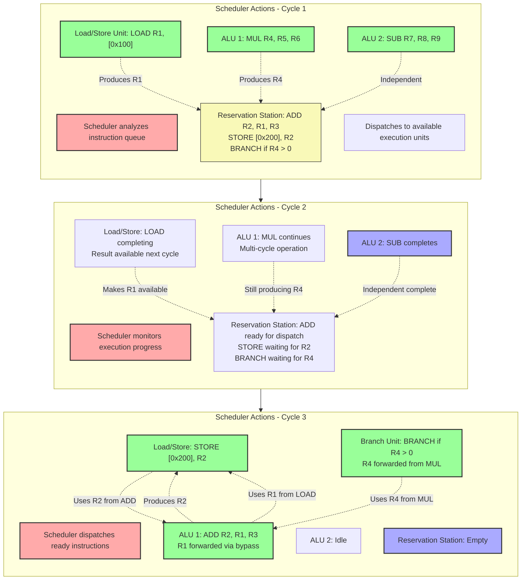

<div align="center">

# Devices
##### **Jerry Zhang** | SHSID Data Science Club**

<div align="left">

## The characteristics of different devices

As you may know, there are many different components to a computer which all can do computation. Most notably are the **CPU** and the **GPU**. This leads to the question "what device is the best for running neural networks?".
To answer this, we first need to understand **precision**, **parallelization**, and the characteristics of each device.

### Precision

Our weight matrices consist of **Floating Point** (**FP**) values, values with a non-integer component. For example $0.175$ or $0.982$.
To store **FP**s, computers use a scientific notation like system. The name of each system is **FP** followed by its bit count.

##### FP32
<table class="bit-diagram">
	<tr> 
		<td class="bit-index">31</td> 
		<td class="bit-index" colspan="9">30-23</td> 
		<td class="bit-index" colspan="2">22-0</td> 
	</tr> 
	<tr> 
		<td class="sign-bit" colspan="1">S</td> 
		<td class="exponent-bits" colspan="8">Exponent (E)</td> 
		<td class="mantissa-bits" colspan="23">Mantissa (M)</td>
	 </tr> 
	<tr> 
		 <td class="bit-size">1 bit</td> 
		 <td class="bit-size" colspan="8">8 bits</td> 
		 <td class="bit-size" colspan="23">23 bits</td>
	</tr> 
</table>

The value of which is $(-1)^S \times (1 + M) \times 2^{(E - 127)}$

The more bits in an **FP** the larger range of values it can represent. 

| Format   | Range |
| -------- | -------------------------------------------------------- |
| **FP16** | $\pm6.10 \times 10^-5 \dots \pm6.55 \times 10^4$         |
| **FP32** | $\pm1.18 \times 10^{-38} \dots \pm3.40 \times 10^{38}$   |
| **FP64** | $\pm2.23 \times 10^{-308} \dots \pm1.80 \times 10^{308}$ |

The *pros* of smaller number of bits would include
- it reduces the required amount of memory
	- this allows for the deployment of large models on lesser devices
	- larger batch sizes in training
- its faster to compute
- lower power consumption (mainly a concern for deployment on mobile devices)

*cons*
- lower precision
	- when lowering a high-precision value to a lower-precision number, this introduces an error, which can accumulate to a decrease in performance
	- very small number in lower-precision can be rounded down to zero, leading to vanishing gradients
	- very large numbers may exceed the limit and become NaN, ruining the model performance and the gradients

### Parallelization

Most computation units in a computer are packed with many different circuits, however, when processing an instruction, only one circuit is used. This is a waste of resources as a task most likely consists of many independent instructions.
#### Basic jargon
##### Clock Cycle
It takes time for electricity for flow through circuits and there is no guaranteeing when a signal is the final result. Therefore the **clock cycle**, a frequency of electricity, decrees when a circuits output is the final output. In other words, a **clock cycle** is a cycle of computation
##### Register
To perform a computation on, for example, two numbers, they need to be first inputted, and then processed. Most processors don't allow direct input-output, values are first inputted and stored in a cache called the **register**, and in the next **clock cycle** they are then processed and outputted. 
#### Parallel processing
##### Multi-ported Registers
To support multiprocessing, the first issue it to be able to take multiple inputs. A **multi-ported register**, as its name suggests allows for many simultaneous readings and writings
##### Bypass networks
To "parallelize" calculations which rely on each other, outputs need to be mapped to inputs without passing through the register, as the register is only called once per **clock cycle**. The Bypass network connects outputs of circuits to the inputs of others.
##### The Scheduler (Reservation Station)
The Scheduler facilitates the bypass network. It checks if all inputs are ready and the circuit is free before sending an instruction. 
#### An example


### The characteristics of different devices

- The **CPU**, *central processing unit*, is the hub of a computer: it can perform all general calculations, manage memory, and etc. However its very slow for the immense amount of parallel processes for neural networks. 
- GPU, *graphical processing units*, were originally designed to speed up graphical computation. Graphical computation involves many parallel computations as indicated by the ten-thousands of pixels on your screen. **CUDA**, Compute Unified Device Architecture, is a parallel computing API proprietary to NVIDIA; it enables GPUs to parallelize general computations, rather than just graphical ones from the OpenGL or Vulkan API.
- **MPS**, apple's imitation of **CUDA** for their SoCs. As of 2025, its less mature than **CUDA**.
- **XPU**, intel's GPUs. Less mature than both Apple and NVIDIA.

### Code

#### Basic Grammar

##### Setting the device
```python
torch.device(device)
```
replace device with `'cuda'`, `'cpu'`, `'MPS'`, or `'XPU'`

##### Moving objects to your device
```python
x = torch.randn(3, 3).to(device)  # tensor to device
model = model().to(device)    # model to device
```
If your using a **CPU** this is not necessary

##### Multiple GPUs
```python
if torch.cuda.device_count() > 1:
    model = torch.nn.DataParallel(model, device_ids=[0, 1])  # Use GPUs 0 and 1
```

##### Clear GPU memory
```python
torch.cuda.empty_cache()
```

#### Techniques

```python
device = torch.device('cuda' if torch.cuda.is_available() else 'cpu')
```
This is a piece of code most Pytorch scripts include.
If your system has a **CUDA** hardware, it will use it; if not, it will use your **CPU**.

```python
loader = DataLoader(dataset, pin_memory=True)  # Faster GPU transfer
```
If your using a GPU, this speeds up the transfer of memory from RAM to GRAM.

```python
from torch.cuda.amp import autocast, GradScaler

scaler = GradScaler()
for x, y in loader:
    optimizer.zero_grad()
    with autocast():
        pred = model(x)
        loss = criterion(pred, y)
    scaler.scale(loss).backward()
    scaler.step(optimizer)
    scaler.update()
```
Mixed precision. A technique NVIDIA developed that uses mixed precision to speed up performance and reduce memory consumption.
However, this technique has some caveats which may lead to decreased performance or even a completely failed training session.
