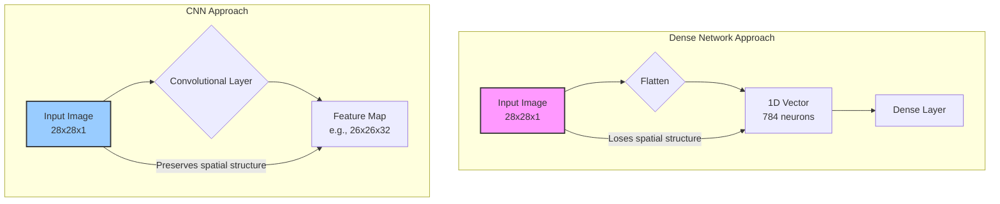
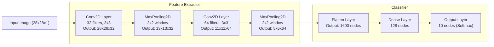

# Seeing the world - Convolutional Neural Networks

*Welcome back to the course, Junior ML Engineers !*

Today we will be learning about the ultimate solution for image processing, **Convulutional Neural Netorks**

---
### Requirements 
* Understanding of the fundamentals of Machine learning
* Basic Knowledge of Neural Networks
* Basic Python and Numpy Library Usage

---
### 1. Problem with Images

You have a small gray scale image of size 28*28 pixels
* Size = 28*28 = 784
* To feed it into a dense layer, we flatten into a vector of **784** numbers.
* If first layer has 128 neurons we will need **100,352** weights

This is a huge problem because:
* It is inefficient with such large parameters to train
* Spatial information is lost when we flatten the image

Now, CNN's are designed to solve the problem with a smart approach


As you see, CNN keeps the image's 2D structure, allowing it to learn from pixel neighborhoods.

---

### 2. The core of CNN : Convolutional Layer

Instead of looking at a large image at once, CNN looks at it in small chunks. 

A **filter** is a small matrix of weights that the network learns. The process of sliding the filter and computing the output is called a **convolution**.

Here's a mini-example of a 2x2 filter sliding over a 3x3 image to produce a 2x2 feature map.

```
Input Image (I)      Filter (K)     Feature Map (O)
+---+---+---+        +---+---+      +---+---+
| 1 | 5 | 2 |        | 1 | 0 |      | 9 | ? |
+---+---+---+        +---+---+      +---+---+
| 8 | 1 | 6 |        | 1 | 0 |      | ? | ? |
+---+---+---+        +---+---+      +---+---+
| 3 | 4 | 7 |
+---+---+---+
```
To calculate the top-left value of the output: `(1*1) + (5*0) + (8*1) + (1*0) = 9`.

#### The Mathematical Logic

The mathematical formula for such operation, **cross-correlation**, looks like this:
$$
O_{i,j} = b + \sum_{u=0}^{F-1} \sum_{v=0}^{F-1} I_{i+u, j+v} \cdot K_{u,v}
$$

Looks complicated right? Lets break it down:

*   $O_{i,j}$: The output value at row `i`, column `j` in the feature map.

*   $b$: A learnable **bias** term, which helps the filter make better predictions.

*   $\sum$: The "sum" symbol. We sum over the filter's dimensions (`u` and `v`).

*   $I_{i+u, j+v}$: A pixel value from the **Input** image patch.

*   $K_{u,v}$: A weight from our **Kernel** (aka **the filter**).

This formula is a precise mathematical formula for cross correlation in Machine Learning, in mathematics convolution is a bit different, it involves flipping the filter (both horizontally and vertically) before sliding it over the image. The reason for such difference is due to the special nature of neural networks, the values in the filter are learned during training, the network can simply learn the flipped version of the filter if it needs to. The cross correlation is easier to implement.

#### Hyperparameters and Output Size
The size of our output feature map depends on the hyperparameters we choose. The output width ($W_{out}$) and height ($H_{out}$) can be calculated with this formula:

$$
W_{out} = \frac{W_{in} - F + 2P}{S} + 1
$$
$$
H_{out} = \frac{H_{in} - F + 2P}{S} + 1
$$

Where:
*   $W_{in}, H_{in}$: Input width and height.
*   $F$: Filter size.
*   $P$: Padding (number of pixels added to the border).
*   $S$: Stride (how many pixels the filter slides at a time).

#### Example Code
 *Note: You can run the following code locally to try out convolutional layers!*

 ```Python
# Remember to use pip to install numpy and matplotlib!
import numpy as np
import matplotlib.pyplot as plt

# 1. Define the Input and Filter
# A simple 6x6 grayscale image. 
# It has a sharp vertical edge down the middle.
# (Low values = dark, high values = light)
input_image = np.array([
    [10, 10, 10, 100, 100, 100],
    [10, 10, 10, 100, 100, 100],
    [10, 10, 10, 100, 100, 100],
    [10, 10, 10, 100, 100, 100],
    [10, 10, 10, 100, 100, 100],
    [10, 10, 10, 100, 100, 100]
])

# A 3x3 filter designed to detect vertical edges.
# The positive values on the left and negative on the right
# will give a high response when we move from dark to light.
vertical_edge_filter = np.array([
    [ 1,  0, -1],
    [ 2,  0, -2], # This is a "Sobel" filter, common in image processing
    [ 1,  0, -1]
])

# 2. The Convolution Operation
# Get dimensions (assuming no padding, stride=1)
img_h, img_w = input_image.shape
filter_h, filter_w = vertical_edge_filter.shape
out_h = (img_h - filter_h) + 1
out_w = (img_w - filter_w) + 1

# Create an empty feature map to store the output
output_feature_map = np.zeros((out_h, out_w))

# Slide filter over the image
for y in range(out_h):
    for x in range(out_w):
        # Get current patch of the image
        image_patch = input_image[y : y + filter_h, x : x + filter_w]
        
        # Perform element-wise multiplication and sum the result
        # This is the core of the convolution!
        convolution_sum = np.sum(image_patch * vertical_edge_filter)
        
        # Store result in the map
        output_feature_map[y, x] = convolution_sum       
# 3.Display Results
print("--- Manual NumPy Convolution ---\n")
print("Input Image:\n", input_image)
print("\nVertical Edge Filter:\n", vertical_edge_filter)
print("\nOutput Feature Map:\n", output_feature_map)
print("\nNotice the high values in the output where the vertical edge was detected!")
# Visualize the images
fig, (ax1, ax2) = plt.subplots(1, 2, figsize=(8, 4))
ax1.imshow(input_image, cmap='gray')
ax1.set_title("Original Image")
ax2.imshow(output_feature_map, cmap='gray')
ax2.set_title("Feature Map (Edges)")
plt.show()
```

---
### 3. Making it Robust: The Pooling layer

A Pooling layer shrinks the feature map to make the network faster and robust. The most common type of pooling is **Max Pooling**.

#### Visualizing Max Pooling

Imagine a 2x2 Max Pooling operation on a 4x4 feature map.

```
Feature Map                     Pooled Output
+---+---+---+---+               +---+---+
|12 |20 | 30| 0 |  max(12,20,8,12)--> |20 |
+---+---+---+---+               +---+---+
| 8 |12 | 2 | 0 |  max(30,0,2,0)-->   |30 |
+---+---+---+---+               +---+---+
|34 |70 | 37| 4 |  max(34,70,112,100)-->|112|
+---+---+---+---+               +---+---+
|112|100| 25| 12|  max(37,4,25,12)--> |37 |
+---+---+---+---+               +---+---+
```
This keeps only the strongest signal, reducing the map size from 4x4 to 2x2.

#### The Math Behind Pooling

Here is the formula for Max Pooling:

$$
P_{i,j} = \max_{0 \le u < F_p, 0 \le v < F_p} A_{i \cdot S_p + u, j \cdot S_p + v}
$$

This formally states: "The output $P_{i,j}$ is the `max` value from the input feature map `A` within the pooling window."

---
### Putting it all together: A full CNN Architecture

A real world CNN stacks up all these layers


The final layer uses a **Softmax** activation function to convert the network's scores into a probability distribution.

The **Softmax** function for a specific output class `i` is:

$$
\sigma(\mathbf{z})_i = \frac{e^{z_i}}{\sum_{j=1}^{C} e^{z_j}}
$$

The formula gurantees that all output values are between 0 to 1 and sums up to be 1. This allows us to treat them as the model's confidence for each class.

---

### 5. Coding Example: Full Functional CNN Architecture

The following example uses Pytorch and Matplotlib to create an example CNN architecture.

``` Python
import torch
import torch.nn as nn
import torch.optim as optim
from torchvision import datasets, transforms
from torch.utils.data import DataLoader
import matplotlib.pyplot as plt

# Define the CNN architecture
class MNIST_CNN(nn.Module):
    def __init__(self):
        super(MNIST_CNN, self).__init__()
        # Feature extractor
        self.features = nn.Sequential(
            nn.Conv2d(1, 32, kernel_size=3),  # 28x28x1 -> 26x26x32
            nn.ReLU(),
            nn.MaxPool2d(2),                   # 26x26x32 -> 13x13x32
            nn.Conv2d(32, 64, kernel_size=3),  # 13x13x32 -> 11x11x64
            nn.ReLU(),
            nn.MaxPool2d(2)                    # 11x11x64 -> 5x5x64
        )
        
        # Classifier
        self.classifier = nn.Sequential(
            nn.Flatten(),                      # 5x5x64 -> 1600
            nn.Linear(5*5*64, 128),            # 1600 -> 128
            nn.ReLU(),
            nn.Linear(128, 10)                 # 128 -> 10
        )
    
    def forward(self, x):
        x = self.features(x)
        x = self.classifier(x)
        return x

# Initialize model, loss function, and optimizer
model = MNIST_CNN()
criterion = nn.CrossEntropyLoss()
optimizer = optim.Adam(model.parameters(), lr=0.001)

# Load MNIST data
transform = transforms.Compose([
    transforms.ToTensor(),
    transforms.Normalize((0.1307,), (0.3081,))
])

train_data = datasets.MNIST('./data', train=True, download=True, transform=transform)
test_data = datasets.MNIST('./data', train=False, transform=transform)

train_loader = DataLoader(train_data, batch_size=64, shuffle=True)
test_loader = DataLoader(test_data, batch_size=1000)

# Training function
def train(model, device, train_loader, optimizer, epoch):
    model.train()
    for batch_idx, (data, target) in enumerate(train_loader):
        optimizer.zero_grad()
        output = model(data)
        loss = criterion(output, target)
        loss.backward()
        optimizer.step()
        
        if batch_idx % 100 == 0:
            print(f'Train Epoch: {epoch} [{batch_idx * len(data)}/{len(train_loader.dataset)} '
                  f'({100. * batch_idx / len(train_loader):.0f}%)]\tLoss: {loss.item():.6f}')

# Test function
def test(model, device, test_loader):
    model.eval()
    test_loss = 0
    correct = 0
    with torch.no_grad():
        for data, target in test_loader:
            output = model(data)
            test_loss += criterion(output, target).item()
            pred = output.argmax(dim=1, keepdim=True)
            correct += pred.eq(target.view_as(pred)).sum().item()
    
    test_loss /= len(test_loader)
    accuracy = 100. * correct / len(test_loader.dataset)
    print(f'\nTest set: Average loss: {test_loss:.4f}, Accuracy: {correct}/{len(test_loader.dataset)} '
          f'({accuracy:.0f}%)\n')
    return accuracy

# Training loop
device = torch.device("cuda" if torch.cuda.is_available() else "cpu")
model.to(device)

accuracies = []
for epoch in range(1, 6):  # 5 epochs
    train(model, device, train_loader, optimizer, epoch)
    acc = test(model, device, test_loader)
    accuracies.append(acc)

# Plot accuracy
plt.plot(range(1, 6), accuracies)
plt.title('Model Accuracy')
plt.xlabel('Epoch')
plt.ylabel('Accuracy (%)')
plt.show()

# Save model
torch.save(model.state_dict(), 'mnist_cnn.pth')
```

### Summary & Conclusion

**Congratulations!** You have just completed your lesson on Convolutional Neural Networks!

Throughout this lesson you have learned:

* How **Convolutional Layers** use filters to find features, and you've seen the formal math behind the process.
* How **Pooling Layers** make the network robust and efficient.
* Understanded the **CNN** architecture and has saw the code to build it.

In the next lesson, we will learn about video data augmentation.
